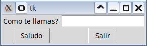
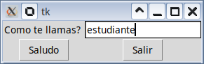
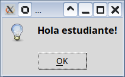

# Práctica de clase: Saludo en GUI

## Descripción

Desarrollar un programa sencillo que muestre un saludo usando una interfaz gráfica basada en Tkinter.

1. Haga un diseño que tenga como mínimo los siguientes widgets:
    * Un Label para indicar el dato a ingresar (en este caso un nombre).
    * Un Entry para ingresar el dato (tenga en cuenta que va a recibir un string).
    * Un Button para realizar la acción de saludo.
    * Un Button específico para salir del programa.
2. La acción de saludo debe tomar el texto ingresado en el cuadro de texto (widget tipo Entry), y mostrar el texto "Hola <nombre_ingresado>" usando la función `messageBox` ([Ver documentación aquí](https://git.cryptomilk.org/projects/cmocka.git/snapshot/cmocka-1.1.7.zip) ).
3. El uso de `print()` es opcional, lo puede usar para hacer debug de su programa.
4. Puede añadir cualquier elemento gráfico para "adornar" la aplicación.

## Ejemplo de interacción

* Pantalla inicial

* Pantalla con texto ingresado

* Respuesta

## Requisitos mínimos

* Debe usar Tkinter, no se espera que use una librería GUI diferente. En caso de dudas, consultar al profesor.
* Debe existir al menos una clase para implementar la aplicación gráfica. El no cumplir con estas condiciones implicará 0.0 en el porcentaje de funcionalidad.
* Se debe instanciar los siguientes objetos de tkinter: una ventana raíz (`Tk()`), un Label, un Entry, dos Button. El no cumplir con estas condiciones implicará 0.0 en el porcentaje de funcionalidad.

## Fecha máxima de entrega

`2025-05-27T07:00:00-05:00`

### Evaluación

|Porcentaje|Item            |Descripción                                                                 |
|:--------:|:--------------:|:---------------------------------------------------------------------------|
|30%       |Sintaxis        |Revisión de sintaxis, 0% si aparece un error                                |
|40%       |Funcionalidad   |Cumplimiento de la funcionalidad del programa                               |
|30%       |Buenas prácticas|Revisión de PEP8, existencia de docstrings y comentarios útiles en el código|
|0%        |Tests unitarios |(desactivados)                                                              |
